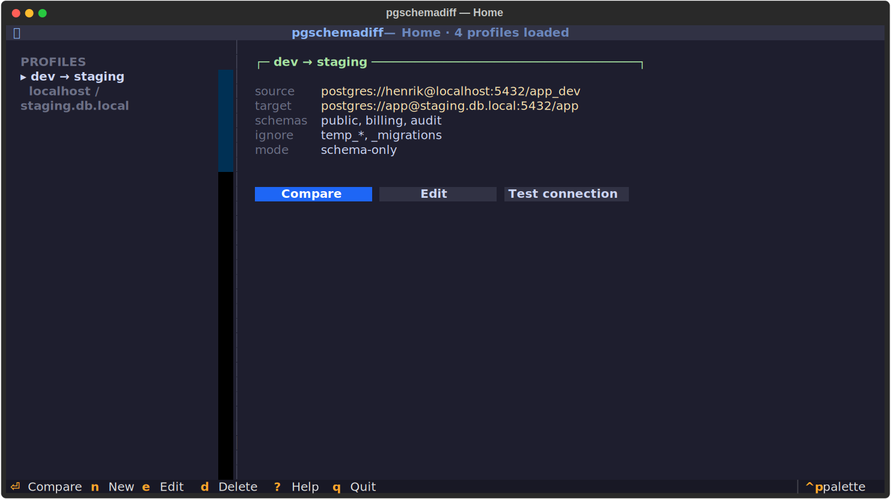

# pgschemadiff

PostgreSQL schema diff & migration tool với TUI (Terminal User Interface) — viết bằng Python 3.13 + Textual.

> **Trạng thái:** Prototype — HomeScreen đã implement, các màn hình tiếp theo đang trong roadmap.



## Cấu trúc hiện tại (prototype)

Hiện tại code đang ở dạng flat prototype ở thư mục gốc. Xem [`docs/architecture.md`](docs/architecture.md) để biết cấu trúc mục tiêu.

```
pgschemadiff/                        repo root
├── pyproject.toml                   uv project, Python ≥ 3.13
├── profiles.yaml                    4 profile mẫu (dev, staging, prod, CI)
├── styles.tcss                      Catppuccin Mocha theme
│
├── __main__.py                      entry point (config resolution + CLI args)
├── app.py                           PgSchemaDiffApp (Textual App)
├── home.py                          HomeScreen — màn hình chính
├── profile.py                       Domain models: Profile, ConnectionInfo
├── profile_item.py                  ListView widget (2 dòng / profile)
├── profile_detail.py                (unused — đã inline vào HomeScreen)
└── yaml_loader.py                   ProfileLoader: đọc/ghi profiles.yaml
```

**Lưu ý:** Các import trong code đã được viết sẵn cho cấu trúc package mục tiêu (`src/pgschemadiff/`). Xem [`docs/migration.md`](docs/migration.md) để biết cách chuyển từ prototype sang cấu trúc đó.

## Chạy thử

> **Yêu cầu:** Cần tổ chức lại files vào `src/pgschemadiff/` trước khi chạy. Xem hướng dẫn chi tiết trong [`docs/migration.md`](docs/migration.md).

Trên Ubuntu với Python 3.13:

```bash
# Cài uv nếu chưa có
curl -LsSf https://astral.sh/uv/install.sh | sh

# Clone và vào thư mục dự án
git clone <repo-url>
cd pgschemadiff

# Sau khi đã reorganize theo docs/migration.md:
uv sync
uv run python -m pgschemadiff

# Hoặc chỉ định config path
uv run python -m pgschemadiff --config /path/to/profiles.yaml
```

### Config path resolution (thứ tự ưu tiên)

1. `--config <path>` / `-c <path>` (CLI argument)
2. `$PGSCHEMADIFF_CONFIG` (environment variable)
3. `./config/profiles.yaml` (local dev)
4. `$XDG_CONFIG_HOME/pgschemadiff/profiles.yaml`
5. `~/.config/pgschemadiff/profiles.yaml`

Hiện tại `profiles.yaml` nằm ở root (không phải `config/`), nên cần dùng `--config profiles.yaml` khi chạy từ thư mục gốc.

## Key bindings

| Phím | Hành động | Trạng thái |
|---|---|---|
| `↑ ↓` | Navigate profile list | ✅ Hoạt động |
| `enter` | So sánh profile đang chọn | ⚠️ Chỉ show notification |
| `n` | Tạo profile mới | ❌ Chưa wired |
| `e` | Sửa profile | ❌ Chưa wired |
| `d` | Xóa profile (có modal confirm) | ✅ Hoạt động |
| `?` | Hiển thị help | ✅ Hoạt động |
| `q` | Thoát | ✅ Hoạt động |

## Những gì đã implement

- [x] Domain models: `Profile`, `ConnectionInfo` (Pydantic frozen)
- [x] YAML loader: `ProfileLoader.load()` và `ProfileLoader.save()`
- [x] `HomeScreen`: layout 2 pane (profile list + detail)
- [x] Detail pane cập nhật real-time khi navigate
- [x] Modal confirm dialog khi xóa profile
- [x] Footer hiển thị key bindings tự động
- [x] Status bar hiển thị số profile đã load
- [x] Catppuccin Mocha theme

## Bước tiếp theo (roadmap)

1. **Reorganize** thành `src/pgschemadiff/` package structure — xem [`docs/migration.md`](docs/migration.md)
2. `screens/comparing.py` — loading screen với Worker async + ProgressBar
3. `screens/diff_explorer.py` — Tree widget cho diff, 3 cột
4. `screens/sql_preview.py` — RichLog với syntax highlight SQL
5. `infrastructure/postgres/inspector.py` — query `pg_catalog` thật
6. `domain/diff/comparator.py` — schema diff logic
7. `domain/migration/generator.py` — sinh SQL migration script

## Tài liệu

| File | Nội dung |
|---|---|
| [`docs/api.md`](docs/api.md) | API reference: models, loader, screens |
| [`docs/architecture.md`](docs/architecture.md) | Kiến trúc hiện tại và mục tiêu |
| [`docs/migration.md`](docs/migration.md) | Chuyển từ prototype sang package structure |
| [`PROGRESS.md`](PROGRESS.md) | Tiến độ chi tiết theo từng phase |

## Lưu ý kỹ thuật

- **Textual bug:** Textual ≥ 0.83 có thể có vấn đề khi extend `Vertical`/`Container` với `compose()` phức tạp — workaround là inline `compose()` vào Screen thay vì tạo widget class riêng. `profile_detail.py` tồn tại nhưng không được dùng vì lý do này.
- **psycopg:** `psycopg[binary,pool]` đã có trong `pyproject.toml` nhưng chưa dùng — sẽ được activate khi implement `screens/comparing.py` và `infrastructure/postgres/inspector.py`.
- **Python 3.13:** Dự án yêu cầu Python ≥ 3.13.
